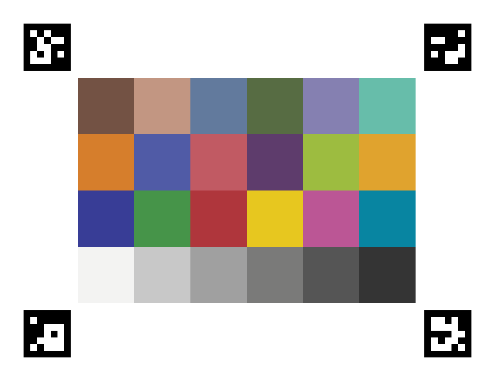
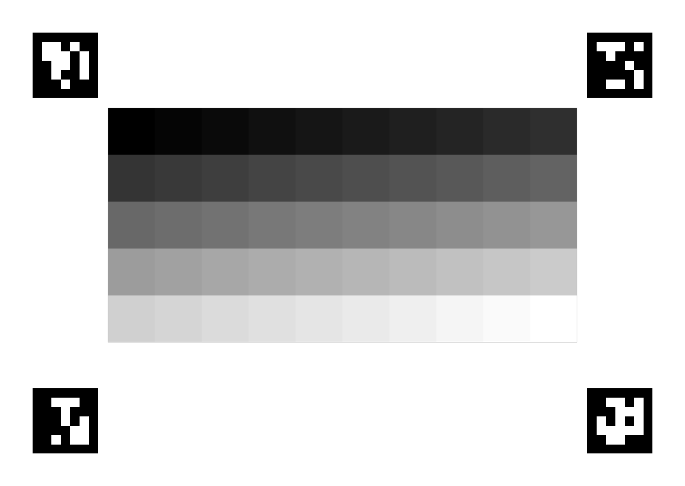

# color-checker-plants

Надёжное определение цветовой мишени через ArUco-маркеры на углах — без хрупкой
детекции контуров. Работает при поворотах до 45°, частичном перекрытии и
умеренном размытии.

---

## Карточки

| X-Rite Classic 24 патча | Градационный серый 50 патчей |
|:---:|:---:|
|  |  |
| ArUco ID 0–3 · 6 × 4 · A4 | ArUco ID 4–7 · 10 × 5 · A4 |

Напечатать карточку:
```bash
python scripts/generate_card.py --preset classic  --output card.png    --dpi 300
python scripts/generate_card.py --preset gray_50  --output gray_ramp.png --dpi 300
```

---

## Colorchecker Classic 24 — полная цветокоррекция

**Когда использовать:** нужно точно исправить цветовой баланс и нелинейности
камеры — съёмка объектов с цветными тканями, кожей, растениями в разном освещении.

Карточка содержит 18 цветных + 6 нейтральных патчей. Это даёт достаточно
ограничений, чтобы правильно подобрать матрицу даже для полиномиального метода.

### Шаг 1 — Напечатать карточку

```bash
python scripts/generate_card.py --preset classic --output card_classic.png --dpi 300
```

Карточка использует **ArUco ID 0, 1, 2, 3** (DICT_5X5_50).

### Шаг 2 — Сфотографировать с карточкой в кадре

- Все 4 маркера полностью в кадре.
- Угол к плоскости карточки — до 45°.
- Равномерное рассеянное освещение, без бликов на карточке.

### Шаг 3 — Обработать в коде

```python
import cv2
from color_checker_plants import detect_color_checker, fit_correction, apply_correction
from color_checker_plants.templates.colorchecker_24 import (
    REFERENCE_SRGB, GRID_COLS, GRID_ROWS, MARKER_IDS
)

image = cv2.cvtColor(cv2.imread("photo.jpg"), cv2.COLOR_BGR2RGB).astype("float32") / 255

result = detect_color_checker(
    image,
    grid_cols=GRID_COLS,          # 6
    grid_rows=GRID_ROWS,          # 4
    reference_colors=REFERENCE_SRGB,
    marker_ids=MARKER_IDS,        # IDs 0–3
)

if result is None:
    print("Маркеры не найдены — все 4 угла должны быть в кадре")
else:
    model = fit_correction(result.measured_colors, result.reference_colors,
                           method="poly")   # или "matrix" / "root_poly"
    corrected = apply_correction(image, model)

    # Сохранить
    cv2.imwrite("corrected.jpg",
                cv2.cvtColor((corrected * 255).astype("uint8"), cv2.COLOR_RGB2BGR))
```

### Методы для colorchecker_24

| Метод | Когда |
|---|---|
| `matrix` | Студийное освещение, простой WB-каст |
| `poly` *(по умолч.)* | Универсально — репортаж, переменный свет |
| `root_poly` | Широкий охват, HDR-камеры, менее склонен к переобучению |

> **Важно:** `poly` и `root_poly` требуют цветных патчей для правильной работы.
> С серой рампой они дадут неверный результат — используй `channel` (см. ниже).

---

## Grayscale Ramp 50 — коррекция экспозиции и WB

**Когда использовать:** нужно исправить равномерный цветовой каст (например,
съёмка в желтоватом или синеватом освещении) и нет физического 24-патч
чекера под рукой. Карточка не содержит цветных патчей, поэтому
**не исправляет перекрёстные связи каналов** — только масштабирует каждый
канал независимо.

Карточка содержит **50 нейтральных патчей** (от чистого чёрного до белого, 10 × 5).
Маркеры **ID 4, 5, 6, 7** — специально отличаются от colorchecker_24 (ID 0–3),
оба чекера можно держать в одном кадре одновременно.

### Шаг 1 — Напечатать карточку

```bash
python scripts/generate_card.py --preset gray_50 --output gray_ramp.png --dpi 300
```

### Шаг 2 — Сфотографировать с карточкой в кадре

Те же требования, что и для colorchecker_24.

### Шаг 3 — Обработать в коде

```python
import cv2
from color_checker_plants import detect_color_checker, fit_correction, apply_correction
from color_checker_plants.templates.grayscale_ramp_50 import (
    REFERENCE_SRGB, GRID_COLS, GRID_ROWS, MARKER_IDS
)

image = cv2.cvtColor(cv2.imread("photo.jpg"), cv2.COLOR_BGR2RGB).astype("float32") / 255

result = detect_color_checker(
    image,
    grid_cols=GRID_COLS,          # 10
    grid_rows=GRID_ROWS,          # 5
    reference_colors=REFERENCE_SRGB,
    marker_ids=MARKER_IDS,        # IDs 4–7
)

if result is None:
    print("Маркеры не найдены — все 4 угла должны быть в кадре")
else:
    model = fit_correction(result.measured_colors, result.reference_colors,
                           method="channel")   # ← обязательно для серой рампы
    corrected = apply_correction(image, model)

    # Сохранить
    cv2.imwrite("corrected.jpg",
                cv2.cvtColor((corrected * 255).astype("uint8"), cv2.COLOR_RGB2BGR))
```

---

## Как это работает — полная цепочка

```
Фото с мишенью
      │
      ▼
[1] Поиск 4 ArUco-маркеров (cv2.aruco)
      │
      ▼
[2] Извлечение внутренних углов маркеров
      │
      ▼
[3] Коррекция перспективы
      │
      ▼
[4] Извлечение цвета из каждой ячейки
      │
      ▼
[5] Подбор матрицы цветокоррекции
      │
      ▼
[6] Применение коррекции ко всему снимку
      │
      ▼
Скорректированный файл + сохранённая модель
```

---

## ArUco-маркеры — подробно

### Какой словарь использовать

| Словарь | Сетка | Расст. Хэмминга | Рекомендация |
|---|---|---|---|
| `DICT_4X4_50` | 4×4 бита | 6 | слабовато |
| **`DICT_5X5_50`** | **5×5 бит** | **8** | **✓ используем** |
| `DICT_5X5_100` | 5×5 бит | 7 | чуть хуже |
| `DICT_6X6_250` | 6×6 бит | 10 | избыточно для печати |

**В проекте используется `DICT_5X5_50`.** Расстояние Хэмминга 8 — маркер
остаётся читаемым, если до 4 из 25 битов испорчены.

### Раскладка маркеров на карточке

```
[ID=0]──────────────────────[ID=1]
│                                │
│         сетка цветов           │
│                                │
[ID=3]──────────────────────[ID=2]
```

| Угол карточки | ID маркера | Внутренний угол маркера |
|---|---|---|
| Верхний левый  | 0 | правый нижний (индекс 2) → TL сетки |
| Верхний правый | 1 | левый нижний  (индекс 3) → TR сетки |
| Нижний правый  | 2 | левый верхний (индекс 0) → BR сетки |
| Нижний левый   | 3 | правый верхний (индекс 1) → BL сетки |

Серая рампа использует те же позиции, но ID **4, 5, 6, 7**.

### Физический размер маркеров

| Дистанция съёмки | Мин. размер маркера |
|---|---|
| 30–50 см (стол, съёмка сверху) | 15 мм |
| 50–100 см | 20 мм ← оптимально для A4 |
| 1–2 м (напольная установка) | 30–40 мм |

Маркер должен занимать **не менее 20–30 пикселей** по стороне на снимке.

### Требования к печати

- **Бумага:** матовая. Глянцевая даёт зеркальные блики.
- **Разрешение:** минимум 150 DPI для маркера от 20 мм. Рекомендуется 300 DPI.
- **Ламинирование:** при съёмке на открытом воздухе — защита от влаги важна.

---

## CLI — подробные опции

### Определение + коррекция одного снимка

```bash
python scripts/process_image.py photo.jpg [--method poly] [--debug]
```

| Опция | По умолчанию | Описание |
|---|---|---|
| `--output FILE` | `<имя>_corrected.jpg` | Куда сохранить результат |
| `--method` | `poly` | Метод: `matrix`, `poly`, `root_poly`, `channel` |
| `--extraction` | `sigma_clip` | Метод извлечения: `sigma_clip`, `median`, `trimmed_mean` |
| `--sigma` | `2.5` | Порог для sigma_clip |
| `--save-model FILE` | — | Сохранить модель коррекции в `.npz` |
| `--debug` | — | Сохранить overlay маркеров и выровненную сетку |

### Пакетная обработка с сохранённой моделью

```bash
# Один раз подобрать модель по эталонному снимку:
python scripts/process_image.py reference.jpg --save-model shoot.npz

# Применить ко всей серии снимков:
python scripts/process_image.py apply --model shoot.npz *.jpg
```

---

## Структура проекта

```
color-checker-plants/
├── color_checker_plants/
│   ├── __init__.py          — публичное API
│   ├── markers.py           — поиск ArUco, извлечение углов сетки
│   ├── detection.py         — главный пайплайн
│   ├── extraction.py        — sigma-clipped mean по ячейкам
│   ├── fitting.py           — подбор матрицы МНК
│   ├── correction.py        — применение коррекции к изображению
│   └── templates/
│       ├── colorchecker_24.py    — эталонные цвета 24-патч + маппинг маркеров
│       └── grayscale_ramp_50.py  — 50 серых патчей, маркеры ID 4–7
├── scripts/
│   ├── generate_card.py     — генератор печатной карточки
│   └── process_image.py     — CLI
├── card_preview/            — PNG-превью всех пресетов карточек
└── CLAUDE.md
```

---

## Зависимости

```bash
pip install opencv-contrib-python numpy scipy
```

**Важно:** нужен именно `opencv-contrib-python`, не `opencv-python` —
ArUco входит только в contrib-версию.
